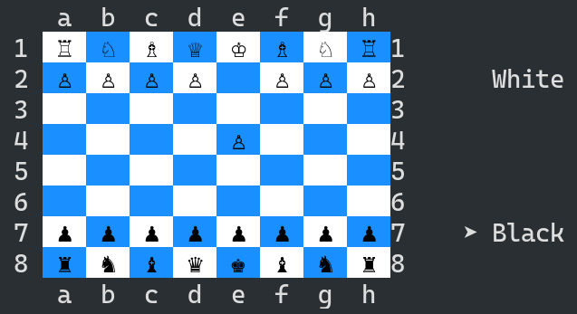
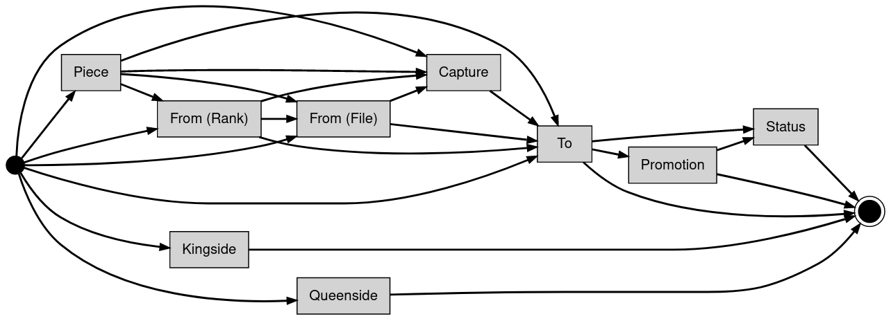

# ADA CHESS

Un jeu d'echecs écrit en Ada, où les deux joueurs jouent en se connectant à un serveur tcp/ip.



## 1. Instructions de build

Le projet construit deux binaires, `server_cli` et `client_cli`, avec la commande suivante :
```
gprbuild -d chess.gpr
```

## 2. Manuel d'utilisation

### 2.1 Serveur

#### Utilisation

```
server_cli [OPTIONS]
```

#### Options

##### `-p PORT` choisit le port où écouter (par défaut 5876)
##### `-c COLOR` choisit la couleur du plateau d'echecs parmi les couleurs du standard ANSI (par défaut Black)
##### `-l LOGLEVEL` choisit le niveau de logs parmi Error, Info ou Debug (par défaut Info)


### 2.2 Client

#### Utilisation

```
client_cli [OPTIONS]
```

#### Options

##### `-p PORT` choisit le port où écouter (par défaut 5876)
##### `-c COLOR` choisit la couleur du plateau d'echecs parmi les couleurs du standard ANSI (par défaut Black)
##### `-l LOGLEVEL` choisit le niveau de logs parmi Error, Info ou Debug (par défaut Info)

#### Mouvement

Le jeu est basé sur terminal, pour bouger le joueur doit utiliser la [notation algébrique](https://en.wikipedia.org/wiki/Algebraic_notation_(chess)) côté client, cette string de mouvement est ensuite parsée par le serveur, validée puis executée.

Par exemple, pour bouger un pion de e7 vers e5, la notation est 'e5'. Pour bouger un cavalier de e8 vers f6, la notation est 'Nf6', ou 'Nef6' en cas d'ambiguité entre les cavaliers si les deux peuvent aller en f6. Les coordonnées d'origine sont donc optionelles, mais les spécifier reste un mouvement valide, cela accélère même le traitement de la commande.

## 3. Architecture du projet

### 3.1 Modules

Les différents modules sont découpés par des sous-dossiers de `src/`, ils sont les suivants:

#### - `Client` qui contient le client appélé par `client_cli`
#### - `Server` qui contient le serveur appelé par `server_cli`
#### - `Board` qui contient l'essentiel du projet, toutes les fonctionnalités allant du parsing à l'execution du mouvement sont effectuées dans ce module
#### - `Logs` le module du logger
#### - `Optional` un record generique permettant de créer des valeurs optionelles comme `std::optional` du c++

### 3.2 Graph de dépendances

Les deux racines sont client et server, ces deux modules utilisent board et logs, board utlisant lui-même logs et optional.

```
           client
          /      \
         /        \
        /  server  \
       /  /      \  \
      v  v        v  v
      logs <----- board ---> optional
```

### 3.3 Client

Le client consiste simplement en une procedure `Launch()` qui tente de se connecter au serveur à l'adresse donnée. Si la connexion est un succès, le client va ensuite entrer la boucle de jeu où tant que la partie n'est pas terminée, on lit les mouvements de l'utilisateur et on les envoie au serveur.

### 3.4 Serveur

Le serveur lui aussi consiste simplement en un procédure `Launch()` qui écoute sur localhost au port donné. Ce serveur doit donc forcément être lancé avant les clients. Une fois les deux clients connectés, on entre là aussi la boucle de jeu où tant que la partie n'est pas terminée, on reçoit les mouvements des joueurs, ces dernières sont ensuite parsés, validés puis executés. Le nouveau board est ensuite envoyé aux joueurs puis on passe au joueur  suivant.

### 3.5.a Board

Le board est le module principal du programme, il définit les différents types dont les pièces et le plateau ainsi qui les fonctions de mouvements. Le module est donc responsable de la validation et de l'execution des mouvements considérés "normaux".

Une des deux fonctions principales est `Move()`, celle-ci prends le mouvement parsé et tente de trouver une pièce du joueur capable de réaliser le mouvement donné ; et si elle la trouve, execute le mouvement. Les différentes étapes de validation sont :
- Recherche d'une pièce candidate avec les bonnes caractéristiques (couleur du joueur, type de pièce et position donnée ou non par le joueur)
- Validation du mouvement de cette pièce vers la case cible selon :
    - les règles communes (on ne peu capturer qu'un pièce de l'autre couleur, ou la case est vide, ou bien la case est vide mais c'est un en passant),
    - les règles spécifiques de la pièce,
    - si ce mouvement ne mettrait pas le Roi allié en echec.

La recherche est un succès s'il y a un seul candidat. Aucun candidat est un mouvement invalide, plusieurs candidats est un mouvement ambigu et le joueur aurait dû spécifier des coordonnées de départ.

L'autre fonction principale est `Game_Ended()`, celle-ci verifie si le mouvement effectué met le Roi adverse en échec, et si c'est le cas, si le Roi adverse et Echec et Mat.

### 3.5.b Board.Castling

Ce sous-module est tourné spécifiquement vers la règle du castling. Lorsque le parseur reçoit "0-0" ou "0-0-0", le mouvement est donc respectivement soit un castling côté Roi soit un castling côté Reine qui, si les conditions sont réunies, est executé sans passer par les règles de mouvement classiques (même si elles sont quand même respectées).

### 3.5.c Board.EnPassant

Ce sous-module est spécifique pour la règle dite en passant. Lorsqu'un pion bouge de 2 cases (donc lors de son premier mouvement), cette pièce est considérée une cible valide pour un en passant lors du prochain tour.

La fonction `EnPassant_Handler()` utilise donc le mouvement précédent pour déterminer si le mouvement courant est un en passant et l'execute, elle ensuite ne considère plus aucune pièce pour en passant car celui-ci n'est possible que pour 1 tour, et enfin enregistre le pion courant s'il bouge de 2 cases pour le prochain tour.

### 3.5.d Board.Strings

Ce module contient les fonctions `Image()` pour tous les composants du module `Board`. Ces fonctions convertissent donc les types internes en chaînes de charactère. Ce module est particulièrement utilisé pour le logging et le pretty printer.

### 3.5.e Board.Strings.Parse

Le parser est responsable de convertir la chaîne de charactère en notation algébrique vers le type interne de mouvement, ce mouvement étant ensuite donné au module principal `Board` pour la validation et l'execution.

Le parser est implémenté par une machine à états, elle même implémentée par un graph dans une matrice d'adjacence. La chaîne de charactères est donnée en entrée de la fonction `Traverse()` qui itère de token en token pour matcher la grammaire et remplir les informations du mouvement.

L'expression régulière est `([KQRBN]?[a-h]?[1-8]?x?[a-h][1-8][QRBN]?[+#]?|0-0[-0])` ce qui donne la machine à états suivante :



D'un point de vue grammaire, tous les champs sont optionels à part le champ `To` qui sont les coordonnées d'arrivée, c'est pourquoi il est possible de partir de n'importe quel état avant `To` vers le suivant jusqu'à `To`, puis de n'importe quel état après `To` vers le suivant jusqu'à la fin. Les deux tokens spéciaux étant le castling qui n'a pas besoin de coordonnées.

### 3.5.f Board.Strings.Pretty

Le pretty printer consiste en une procédure `Pretty_Print()` qui prend le board en entrée (et optionellement le joueur courant) et affiche le plateau avec les pièces en couleurs sur le terminal.


### 3.6 Logs

Le loggeur est assez simple, il consiste en une variable globale `Level` qui est soit `Error`, soit `Info`, soit `Debug`. Lorsqu'une des procédures `Error()`, `Info()` ou `Debug()` est executée, si le niveau de la procédure correspond au niveau global, le loggeur va afficher une string formatée au format `[CLOCK][LEVEL] MESSAGE`.

```
[2021-02-04 17:05:26][INFO ] Set logging level to info
[2021-02-04 17:05:26][INFO ] Listening on 127.0.1.1:5876
[2021-02-04 17:05:26][INFO ] Waiting for player 1
```

### 3.7 Optional

Ce record utilitaire permet donc d'implémenter un équivalent de `std::optional` du c++, il a un paramètre booléen `IsEmpty` qui résulte en un record null si `True`, une valeur de type `T` si `False`. Ce optional est souvent utilisé dans le board pour représenter une case vide ou encore des valeurs non renseignées dons la notation algébrique.


## 4. DO178

### 4.1 High Level Requirements

HLR 1: les utilisateurs devraient pouvoir se connecter à un serveur

HLR 2: les utilisateurs devraient pouvoir commencer une partie quand deux
clients sont connectés

HLR 3: le joueur avec les pièces blanches devrait jouer en premier

HLR 4: les joueurs devraient voir un plateau de jeu actualisé lorsque c'est a
leur tour de jouer

HLR 5: les joueurs devraient pouvoir déplacer leurs pièces

HLR 5.1: les pièces devraient avoir un mouvement particulier selon leur type

HLR 5.2: les pièces devraient avoir un ensemble de destinations possibles
selon leur position

HLR 5.3: si la destination d'une pièce ne fais pas partie de l'ensemble de ses
destinations possibles, un message d'erreur devrait être affiché et la
destination devrait être donnée à nouveau

HLR 5.4: si un joueur est en echec, il ne devrait pouvoir faire que des
mouvements lui permettant de ne plus être en echec

HLR 5.5: si un joueur déplace son pion jusqu'au bout du plateau, il devrait
pouvoir le tranformer en n'importe quelle autre pièce

HLR 6: les joueurs devraient pouvoir prendre une pièce a l'adversaire

HLR 6.1: les joueurs devraient pouvoir prendre une pièce a l'adversaire avec
la règle dite en passant

HLR 6.2: les joueurs ne devraient pas pouvoir prendre le roi adverse

HLR 7: la partie devrait se terminer quand un joueur est en echec et mat

### Derived HLR:

### 4.2 Low Level Requirements

LLR 1.1: quand Launch() est appelée avec une adresse IP et un port valides, le client devrait pouvoir se connecter au serveur

LLR 1.2: quand Launch() est appelée avec une adresse IP ou un port invalide, le client devrait afficher un message d'erreur

LLR 2.1: quand Launch() est appelée, le serveur devrait attendre la connexion de deux clients et lancer une partie

LLR 3.1: quand GetWhitePlayer() est appelée, le serveur devrait définir le joueur avec les pièces blanches comme le premier a jouer

LLR 4.1: quand Board\_t'Output() est appelée, le serveur devrait envoyer le plateau actuel au client qui doit jouer son tour, quand PrettyPrint() est appelée par ce client le plateau devrait s'afficher

LLR 5.1.1: quand String'Output() est appelée, le client devrait envoyer son déplacement au serveur

LLR 5.1.2: quand le mouvement est valide Move() devrait bouger la pièce

LLR 5.2.1: IsValidMove\_{PieceName}() devrait valider un mouvement spécifique à la pièce

LLR 5.3.1: IsValidMove() devrait vérifier la validité d'un mouvement peu importe la pièce

LLR 5.4.1: quand IsValidMove() retourne true, mais IsKingCheck() retourne aussi true, le mouvement est invalide

LLR 5.5.1: quand l'argument CurrMove de la fonction Move() a les propriétés suivantes: la pièce est un pion, la destination est au dernier rang, et la promotion est spécifiée ; le pion devrait recevoir une promotion

LLR 6.1: quand Move() est appelée, si une pièce se déplace sur la case d'une pièce adverse, elle devrait la remplacer et donc la prendre

LLR 6.1.1: quand EnPassantHandler() est appelée, un pion devrait pouvoir prendre un pion adverse avec la règle dite en passant

LLR 6.2.1: tant que IsKingCheck() renvoie true, le joueur doit envoyer une nouvelle destination, le roi ne devrait donc pas pouvoir être pris

LLR 7.1: quand GameEnded() renvoie CheckMate, la partie devrait se terminer

### Derived LLR:

### 4.3 Tests

Les LLR sont testées unitairement, le code des tests est contenu dans `test/llr/` au format `llr_<num>_<name>_<pass|fail>.adb`. Chaque test génère un executable dans `/obj/`.

Afin de faciliter l'évaluation des tests, une test suite `test/test_suite.sh` permet de simplement les lancer à la suite et d'afficher 'pass' ou 'fail' si le resultat est celui attendu.
