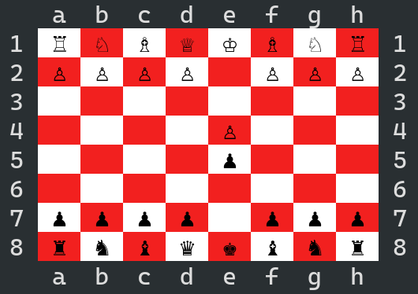

# ADA CHESS

A chess game written in Ada, where both players play by sending tcp commands to a server.



## 1. Build

Build the project with the command:
```
gprbuild -d chess.gpr
```

## 2. Server

### Usage

```
server_cli [OPTIONS]
```

### Options

#### `-p PORT` set the port to listen on
#### `-c COLOR` set the board color among ANSI colors
#### `-l LOGLEVEL` set the log level among Error, Info or Debug


## 3. Client

### Usage

```
client_cli [OPTIONS]
```

### Options

#### `-p PORT` set the port to connect to
#### `-c COLOR` set the board color among ANSI colors
#### `-l LOGLEVEL` set the log level among Error, Info or Debug

### Movement

The game is terminal based, to move one must use the [algebraic notation](https://en.wikipedia.org/wiki/Algebraic_notation_(chess)). The resulting string is then parsed on the server side and executes the movement if valid.


